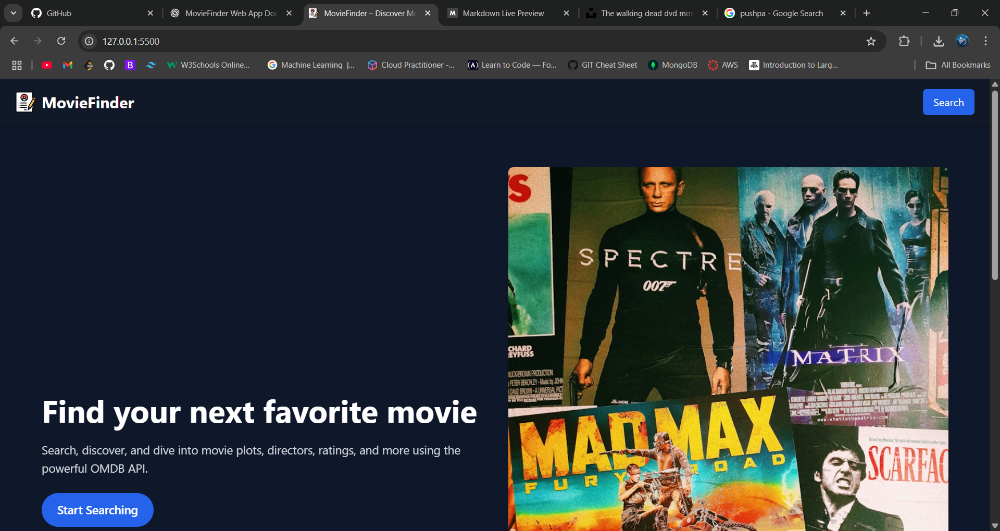
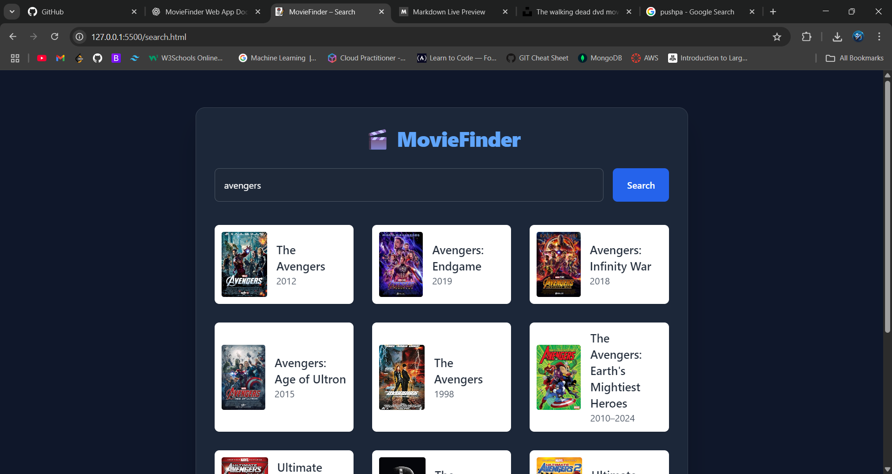
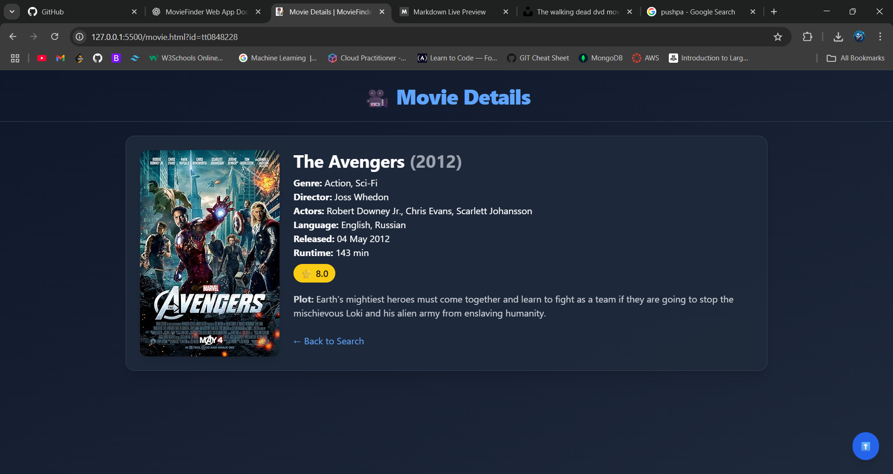

# 🎬 MovieFinder

MovieFinder is a simple and elegant web application that allows users to search for movies, view detailed information, and watch trailers — all using the OMDB API.


## 🚀 Features

- 🔍 **Search Movies** by title using the OMDB API
- 🎞️ **View Detailed Information** – including genre, director, cast, release date, plot, and rating
- 🌇 **Responsive UI** with Tailwind CSS and AOS animations
- ⬆️ **Back to Top Button** for smooth UX
- 🌌 **Dark Themed Landing Page** with a modern aesthetic

---

## 🛠️ Tech Stack

- **HTML/CSS**
- **Tailwind CSS**
- **JavaScript (Vanilla)**
- [OMDB API](https://www.omdbapi.com/)
- [AOS.js](https://michalsnik.github.io/aos/) for scroll animations

---

## 📁 Project Structure

```

📦 MovieFinder
├── index.html          // Landing page
├── search.html         // Movie search page
├── movie.html          // Movie details page
├── script.js           // Main JavaScript file
├── assets/
│   └── bg.jpg          // Background image
└── README.md

````

---

## 📸 Screenshots

### 🔹 Landing Page


### 🔹 Search Page


### 🔹 Movie Details


> *(You can add screenshots manually and replace these filenames)*

---

## 🔧 Setup Instructions

1. **Clone the repository**
   ```bash
   git clone https://github.com/your-username/moviefinder.git
   cd moviefinder

2. **Open `index.html` in your browser** or deploy using GitHub Pages.

---

## 🌐 Live Demo

> 🔗 [https://your-username.github.io/moviefinder](https://b-acharekar.github.io/movie-finder/)

---

## 📌 Credits

* [OMDB API](https://www.omdbapi.com/)
* [Tailwind CSS](https://tailwindcss.com/)
* [AOS Scroll Library](https://michalsnik.github.io/aos/)

